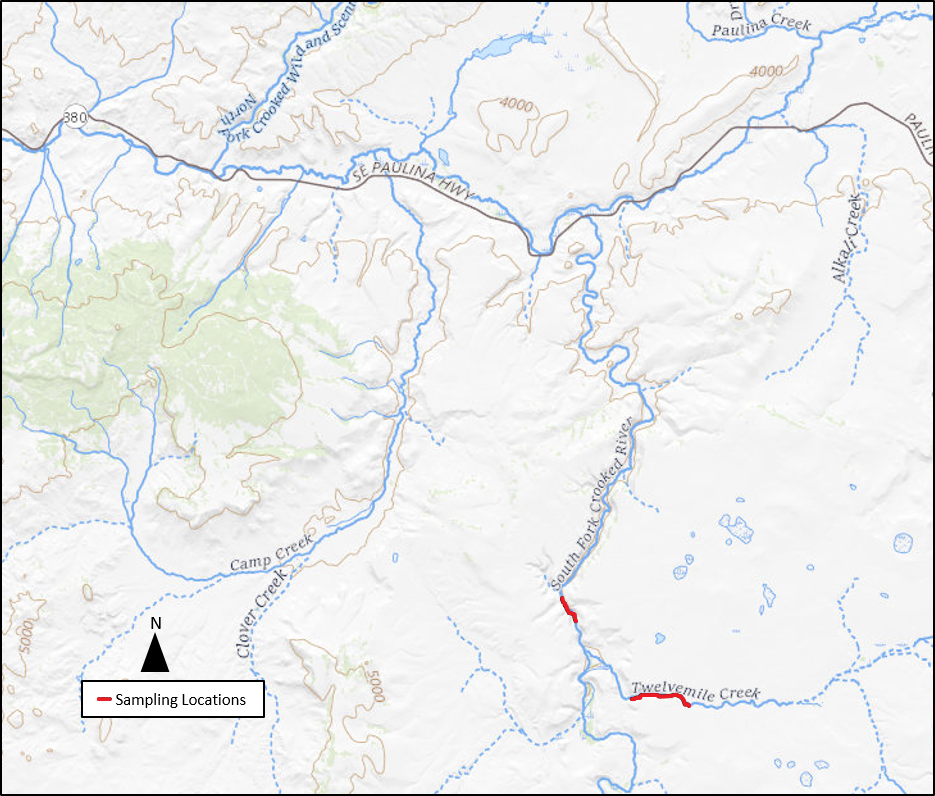

```{r, message=FALSE, warning=FALSE}
require(rubias)
require(adegenet)
require(knitr)
require(tidyverse)
require(magrittr)
```

# Readme

This is document is an R notebook. If you'd like view to pre-rendered figures, read a summary of analysis and interact with code, please open this html file in a browser. 

To conduct a similar analyses on your computer, edit or run code: clone this repository into a directory on your local machine and open the .Rproj file in Rstudio.

The entire project is version controlled and stored as an R project on github at https://github.com/david-dayan/sf_crooked_river_2021.

# Rationale

This is the final analysis log for the 2021 South Fork Crooked River O. mykiss project. 

The goal is to conduct genetic stock identification and determine if trout of unknown origin in the South Fork of the Crooked River and its tributary Twelvemile Creek are descendents of locally adapted redband trout represented by a nearby native population (Paulina Creek), or descendents a hatchery stock provided as a reference from USFWS (127H - Cranebow / Wizard Falls). 

{width=50%}

This notebook is an update to a previous notebook that included reference samples unlikely to relevant to the analysis, some errors in the history of the system and the inclusion of replicated individuals.

### History of Stocking on SF Crooked 
Text below is the conclusion of conversations between KGO and from Tim Porter (ODFW), with some added comments from DID for clarity (italics). Note there are multiple conflicts between this summary and others, but we are most confident in this version of events. Notes are available in the directory "data from odfw" in the project repository.  

1. 1981: unknown, but presumably native fish   
2. 1981: Rotenone, _entire system, including tributaries_   
3. Since 1982, the SF Crooked River system has been stocked only with hatchery-raised summer steelhead Deschutes River stock 66H _(produced at the Oak Springs Hatchery)_, fin-clipped redband trout stock 153H and possibly steelhead with origins from the upper Crooked River basin. Monitoring in the SF Crooked did not find any evidence of natural production. However, monitoring was not conducted in Twelvemile Creek.  
4. In the early 2000’s ODFW started a program to produce a locally adapted stock by collecting gravid adult redband trout in the Ochoco National Forest from several different streams that were geographically close to each other. The main streams they collected wild adults from included Paulina Creek, Wolf Creek, and Sugar Creek. These adult fish were spawned in the Oak Springs Hatchery _(stock 153H)_, and then returned to their native stream. Fin-clipped 153H fingerlings were stocked in the SF Crooked from 2004-2009. The Cranebow stock _(stock 127H - Wizard Falls hatchery)_ was used in 2010 and 2011. Due to successful natural production and good population dynamics, ODFW ceased stocking the SF after the 2011 release.   
5. Stock 153H was not at Oak Springs for very long so USFWS probably never obtained any samples from them before they were discontinued. That was one reason ODFW collected samples from Paulina Creek for comparison to the unknown samples. ODFW assumes that the Paulina Creek samples would be very similar to any 153H fish if they were still present in the South Fork Crooked since that is one of the creeks were the broodstock was collected.  
6. 2013: Dewatering, all fish presumed killed.  
7. 2014-present : Since the locally adapted stock program (153H) had been discontinued, ODFW stocked with Cranebows (Wizard Falls Hatchery, Redband Trout stock 127H) to provide a fishery with a somewhat locally adapted stock that would survive the hot summers better than our typical hatchery stocks. Collecting native fish and stocking their progeny wasn’t very effective and it was extremely expensive. We weren’t going to go through that effort if there weren’t assurances that the dewatering wouldn’t happen again. Cranebows are hatchery fish derived from wild redband trout that were collected near Crane Prairie. The hatchery personnel create a common name in addition to the stock number that usually includes a geographical reference to their origin. For example, the Cape Cod, Roaring River and Eagle Lake stocks are other names of hatchery rainbows that ODFW stocks. Technically, they would be considered redbands, but there are most likely differences between Cranebows and Crooked River basin redbands, especially since the Cranebows have been in the hatchery system for a while. 
8. According to ODFW records, stock 53H was never used in the SF Crooked. 
9. In 2016, ODFW translocated 105 wild redband trout from Paulina Cr, Wolf Cr, and North Wolf Cr into the South Fork Crooked to see if natural production could be initiated.   
10. The local BLM biologist said he saw trout in Twelvemile Creek that look like native redbands based on parr marks and fin quality. ODFW had not stocked Twelvemile Creek, so they decided to collect genetic samples from Twelvemile Creek and unmarked trout from SF Crooked to see if some native redbands survived the rotenone treatment and are repopulating or if they are just descendants of Cranebows from Wizard Falls Hatchery (stock 127H). It is possible that the fish could be descendents of the 153H stock. In this case, ODFW did not think it would be possible to differentiate them from other native redband stocks so they would consider them native redbands. The samples being either true native redband or descendants of 153H stocked fish would be the desired outcome as they would have locally adapted genetics.  


# Data

## Raw Data

__Available Data__  

* Sample Data (fin clips from fish sampled in 2019 and 2020), genotyped using the Omy392 panel (genotyping log available in notebook titled "genotyping_notebook" in repository.)   
  * SF Crooked (n = 17), unknown origin  
  * Twelvemile Creek (n = 41), unknown origin  
  * Paulina Creek (n = 35), native redband to use as reference with other references below  
  
* Reference Data  
  * Omy379, genotyped using the Omy379 panel (note these individuals are repeats of the individuals in the Omy269 reference)  
      * Cape Cod Hatchery	(n = 10)  
      * Crane Prairie Reservoir	(n = 1)  
      * Oak Springs Hatchery (n = 10)  
      * Round Butte Hatchery (n = 11)  
      * Wizard Falls Hatchery	(n = 11)  
  * Omy269, samples genotyped using the Omy269 panel  
      * Cape Cod Hatchery (stock 72)		(n = 45)  
      * Crane Prairie Reservoir	(n = 0 ) 
      * Oak Springs Hatchery (stock 53H ???) (n = 43)  
      * Round Butte Hatchery (n = 0)   
      * Wizard Fall Hatchery (stock 127) (n = 34)  
      
__Data Used in Analysis__  

We used an intersect join of the sample data and the Omy269 reference data ($SFGL\bigcap Omy269$). We considered only stock 127H (Wizard Falls / Cranebows) and Paulina Creek. Details about this approach to combining datasets and the underlying rationale is available under the [Combining Datasets] header of the [Supplemental Information] section found at the end of the notebook.

## Data Setup
```{r, message = FALSE}
# First load the sample genotypes
load("genotype_data/genotypes_2.2.R")

#then load the Omy269 reference
genos_269 <- readxl::read_xlsx("data_from_odfw/Mykiss_GT_genosUSFSW.xlsx", sheet=1)

#convert colname formatting to match
colnames(genos_2.2) <- gsub("\\.", "", colnames(genos_2.2))
colnames(genos_2.2) <- gsub("-", "", colnames(genos_2.2))
colnames(genos_2.2) <- gsub("_", "", colnames(genos_2.2))
genos_2.2 %<>%
  rename(Population = Stream)

genos_269 %<>%
  rename_with(~ gsub("_","", .x, fixed = TRUE))


common_cols <- intersect(colnames(genos_2.2), colnames(genos_269))

# remove data from reference data that is absent from sample data and remove unwanted references
genos_269 %<>%
  rename(sample = Indidividual) %>%
  select(sample, common_cols) %>%
  filter(Population != "CapeCodHatcheryStrain") %>%
  filter(Population != "OakSpringsHatchery")


genos_3.0 <- genos_2.2 %>%
  select(sample, common_cols)

#combine
genos_2.3 <- genos_3.0 %>%
  bind_rows(genos_269)

genos_2.3 %<>%
  mutate(Population = case_when(Population == "WizardFallsHatchery" ~ "WizardFalls-127H",
                                TRUE ~ Population))

#convert to matrix with inds as row names
genos_2.4 <- as.matrix(genos_2.3[,3:251]) #caution potential hardcoding to exclude sex marker, get rid of the "-1" if you don't have a sex marker
row.names(genos_2.4) <- genos_2.3$sample
genind_1.0 <- df2genind(genos_2.4, sep ="", ploidy=2,NA.char = "NA")

genind_1.0@pop <- as.factor(genos_2.3$Population)

kable(genos_2.3 %>%
        ungroup() %>%
        count(Population), caption = "Final Sample Sizes;\nIndividuals are genotyped at 250 genetic markers")
```


# Approach Summary

In this notebook we will first use principal component analysis to identify unconstrained patterns of variation in the data to establish some hypotheses and develop specific questions that can be addressed by subsequent analysis. Then we will conduct genetic stock identification using _rubias_, assign individuals to genetic clusters using discriminant analysis of principal components (DAPC), and finally infer individual proportions of ancestry from different genetic clusters using STRUCTURE.


# Exploratory Analysis

## PCA
The first step is PCA, where we take a look at the unconstrained patterns of variation in the data to establish some hypotheses to test later.

__How Many PCs?__  
First let's examine how much of the variance in the dataset is likely to be interesting using the Kaiser-Guttman Criterion and the Broken Stick Method

```{r, message=FALSE, warning=FALSE}
# set missing data to mean allele freq (PCA does not accomodate NAs)
X <- scaleGen(genind_1.0,  NA.method="mean")


#then run pca, keep all PCs
pca1 <- dudi.pca(X, scale = FALSE, scannf = FALSE, nf = 250)

### check pcs to keep with kaiser-guttman and broken stick

#kaiser guttman
cutoff<-mean(pca1$eig)
kg <- length((pca1$eig)[(pca1$eig)>cutoff])
barplot(pca1$eig, main = "PCA eigenvalues\nKaiser-Guttman Criteria (red line)")
abline(h = cutoff, col = "red")

#broken stick
n <- length(pca1$eig)
bsm <- data.frame(j=seq(1:n), p = 0)
bsm$p[1] <- 1/n
for (i in 2:n){
  bsm$p[i] <- bsm$p[i-1]+(1/(n+1-i))

}
bsm$p <- 100*bsm$p/n

pca_eigs_to_plot <- as.data.frame(cbind(100*pca1$eig/sum(pca1$eig)), rev(bsm$p))
pca_eigs_to_plot %<>%
  rownames_to_column(var = "bsm") %>%
  rename(pca_eig_perc = V1) %>%
  mutate(pca_eig_perc = as.numeric(pca_eig_perc))

pca_eigs_to_plot %<>%
  rowid_to_column("row_n") %>%
  mutate(bsm = as.numeric(bsm)) %>%
  pivot_longer(!row_n, names_to = "bsm_or_eig", values_to = "percent_variance")

ggplot(data = pca_eigs_to_plot[1:71,])+geom_bar(aes(x = as.factor(row_n), y = percent_variance, color = bsm_or_eig, fill = bsm_or_eig), stat = "identity", position=position_dodge())+theme_classic()+xlab("Eigenvector")+ylab("percent of variance")+ggtitle("Broken Stick Model")

```

Kaiser-Guttman (liberal) suggests retaining the first 42 axes of genetic variation, Broken-Stick Model (conservative) suggests only the first two.

__PCA Results__

Below are PCA results for (a) principal components 1 and 2, (b) principal components 3 and 4, and (c) a 3d interactive plot of principal components 1, 2 and 3
```{r}
#kept all PCs
snp_pcs <- pca1$li#[,c(1:kg)]

#now plot data
snp_pcs %<>%
  rownames_to_column("sample") %>%
  left_join(select(genos_2.3, sample, Population), by = c("sample" = "sample"))


ggplot(data = snp_pcs)+geom_point(aes(Axis1, Axis2, color = Population), alpha = 0.7) + stat_ellipse(aes(Axis1, Axis2, color = Population)) +theme_classic()+scale_color_manual(name = "Population", values = c("#4477AA", "#228833",  "#EE6677", "#AA3377"))

ggplot(data = snp_pcs)+geom_point(aes(Axis3, Axis4, color = Population), alpha = 0.7) + stat_ellipse(aes(Axis3, Axis4, color = Population)) +theme_classic()+scale_color_manual(name = "Population", values = c("#4477AA", "#228833",  "#EE6677", "#AA3377" ))


#3d plot as well
plotly::plot_ly(x=snp_pcs$Axis1, y=snp_pcs$Axis2, z=snp_pcs$Axis3, type="scatter3d", mode="markers", color=snp_pcs$Population, alpha = 0.8)
```

It looks like the first two principal components capture variation in the dataset that maps neatly onto populations and are of greatest interest to us.

Most SF Crooked individuals cluster with stock 127H individuals along both informative axes of genetic variation. Paulina Creek forms its own cluster along these axes. Twelvemile Creek individuals cluster together and fall in an intermediate position between the (127H + South Fork) cluster and Paulina Creek along the first axis. However, the second major axis of genetic variation captures differences between Twelvemile Creek and all other groups. The third axis also captures genetic variation that is greater within Twelvemile Creek than other populations.

This second axis complicates a simple interpretation that Twelvemile Creek are a native-like population experiencing admixture between the hatchery stock descended individuals (127H) in the South Fork and a Paulina-like ancestor (from stock  153H, 2016 reintroduced Paulina+Wolf Creek native fish, or refugial survivors of the rotenone and dewatering event). Instead, we observe additional genetic variation that suggests that some of the differentiation between Twelvemile Creek Fish and 127H+SF Crooked is separate from the differentation between Paulina Creek and 127H+SF Crooked samples. This suggests that Paulina Creek may be more similar to Twelvemile creeks samples than 127H+SF Crooked at some of our genetic markers, but there is an additional aspect of genetic variation that makes Twelvemile Creek fish unique. This fits with the idea that Paulina represents a close fit to the true Twelvemile Creek redband ancestors, but Twelvemile Creek fish are not directly descended form Paulina, instead they simply share a more recent common ancestor than Twelvemile and 127H+SF Crooked. This also suggests we'll have some issues with GSI, as Paulina may be a poor stand in for the true source population for Twelvemile Creek fish.

# Hypotheses

My best guess as to what is going on here is that the local BLM biologist was right; Twelvemile creek fish are not descended from 127H (hypothesis 0 belpw), instead we're looking at fish on the Twelvemile with some native ancestry that have experienced admixture with the hatchery derived, but naturally reproducing population on the mainstem (hypothesis 1 below).  

The challenge is accomodating the observation that Twelvemile Creek varies along a distinct axis of genetic variation from all other populations which could be caused by either Paulina Creek being a slightly deficient proxy for true native-like ancestors (stock 153, 2016 reintroduction from Paulina Creek + Wolf Creeks, and/or refugial survivors of rotenone and dewatering) (hypothesis 1a) or the total absence of an alternative ancestral population in our reference samples (such as stock 66H or Paulina creek being an extremely poor proxy for native ancestors) (hypothesis 2).  

For clarity, let's define all of these possibilities:

__Hypothesis 0:__ Both South Fork Crooked and Twelvemile are primarily descendended from stock 127H.  
__Hypothesis 1:__ Twelvemile Creek are descendents of native or native-like ancestors with some admixture with 127H
__Hypothesis 1a:__ Hypothesis 1 and Paulina Creek is a slightly imperfect proxy for these ancestors leading to unique genetic characteristics of the Twelvemile sample
__Hypothesis 2:__ Twelvemile is descended from an entirely different population not included in our reference such as 66H or Paulina is a very poor proxy for putative locally adapted ancestors and there has been subsequent admixutre with 127H. We can discount this one only if we're confident that there was not natural production before introduction of stocks 153H, 127H and the 2016 reintroductions. Note that this outcome could mean that Twelvemile are descended from locally-adapted native fish OR stock 66H.

Let's try to develop specific expectations from GSI, STRUCTURE and DAPC that will allow us to distinguish these hypotheses developed from the exploratory data analyses above (PCA). 

__Structure:__  
0: 127H, SF Crooked and Twelvemile samples have one genetic cluster that composes the majority of their inferred ancestry and Paulina a second.  
1: Two genetic clusters, one composing the majority of the ancestry for Paulina and Twelvemile and a second for South Fork and 127H.  
1a: At low _k_, 127H and SF Crooked samples have one genetic cluster that composes the majority of their inferred ancestry, Paulina a second, and Twelvemile Creek individuals will have consistently mixed admixture between these two clusters. At high enough _k_, we will be able to tell the difference between Paulina and Twelvemile and Twelvemile will have its own major cluster, but still demonstrate some ancestry from 127H and Paulina Creek clusters.  
2: At high enough _k_ 127H and SF Crooked samples have one genetic cluster that collectively composes the majority of their inferred ancestry, Paulina a second, and Twelvemile a third.

__de novo DAPC:__  
0: One DAPC axis capturing differences between Paulina and all others. Subordinate DAPC axes among de novo clusters will not clearly map onto a priori populations.  
1: One DAPC axis separating Paulina+Twelvemile and 127H+SF Crooked. Twelvemile falling in between Paulina and 127+SF Crooked is also consistent if there is sufficient admixture. Subordinate DAPC axes among de novo clusters will not clearly map onto a priori populations.  
1a: One DAPC axis among de novo genetic clusters will discriminate 127H and SF Crooked from Paulina, with Twelvemile intermediate, a second DAPC axis will separate Twelvemile creek from all other.  
2: Exact same as 1a, or possibly same pattern but in different order of importance.  

__GSI:__  
0: All assign to 127H  
1: Twelvemile assigns to Paulina, SF Crooked to 127H  
1a/2: Rubias GSI will not be able to distinguish 1a and 2. Under both scenarios Rubias will assign all South Fork samples to 127H, and will struggle to assign Twelvemile samples. Twelvemile samples will either be assigned to Paulina with low confidence, or to both Wizard Falls and Paulina, also with low confidence.  

__Summary__ 

It will be difficult to discriminate between hypothesis 1a and 2 with the data and tools brought to bear here. Instead, discounting hypothesis 2 will require confidence that there was no natural production from stock 66H or native fish on Twelvemile Creek, but naturally production was never assessed on Twelvemile Creek. STRUCTURE will be particularly important because individuals can derive their ancestry from multiple ancestral genetic clusters, allowing clearer inference of admixture than with GSI or DAPC. We could also try some other methods here if we want to invest more time. 

# Rubias  

Our first attempt at assignment will use rubias GSI against stock 127H and Paulina Creek as references.

## Reformat Data

The first step is to combine availbale information from possible source and sample populations into a single dataframe with the correct format. 
```{r, message=FALSE, warning = FALSE}


baseline_269 <- read_tsv("genotype_data/baseline_269.txt")
baseline_269 %<>%
  mutate(across(everything(), as.character)) %>%
  rename_with( ~ gsub("_", "", .x, fixed = TRUE))


load("genotype_data/genind_2.0.R")

baseline_paulina <- read_tsv("genotype_data/paulina.txt")
baseline_paulina %<>%
  mutate(across(everything(), as.character)) %>%
  rename_with( ~ gsub("_", "", .x, fixed = TRUE))

samples_GSI <- read_tsv("genotype_data/sample_genos.txt")
samples_GSI %<>%
  mutate(across(everything(), as.character)) %>%
  rename_with( ~ gsub("_", "", .x, fixed = TRUE))

#combine all of these into a single dataframe
#here we keep only markers in all both

common_cols <- intersect((colnames(samples_GSI)), (colnames(baseline_269)))

GSI_reference <- bind_rows( samples_GSI, baseline_269, baseline_paulina)%>%
  filter(repunit != "CranePrarieReservoir") %>%
  filter(repunit != "CapeCodHatcheryStrain") %>%
  filter(repunit != "OakSpringsHatchery") %>%
  select(common_cols) %>%
  rename(sample_type = sampletype) %>%
  filter(sample_type != "mixture")

samples_GSI %<>%
  select(common_cols) %>%
  rename(sample_type = sampletype)

```

The combined dataset has 250 common markers.

## Power/Accuracy Simulation

Next we run some simulations using the reference dataset to asses the accuracy and power of the reference to correctly assign the halfpounders.

### Reference Self-Assignment

First we attempt self-assignment of reference samples to their reporting group using a leave-one-out approach.

```{r, message=FALSE, warning = FALSE, results = "hide"}
sa <- self_assign(reference = GSI_reference, gen_start_col = 5)

#summarise by reporting unit
sa_to_repu <- sa %>%
  group_by(indiv, collection, repunit, inferred_repunit) %>%
  summarise(repu_scaled_like = sum(scaled_likelihood))

# for each individual, assign to most likely reporting unit
sa_assign <- sa_to_repu %>%
  group_by(indiv) %>%
  slice_max(repu_scaled_like)

sa_assign$correct_assignment <- sa_assign$repunit == sa_assign$inferred_repunit

sum(sa_assign$correct_assignment/nrow(sa_assign))
```

Self-assignment assigns (maximum scaled likelihood) reference individuals back to correct reporting unit 100% of time.


### Simulated Mixture

While we can successfully assign reference individuals back to the correct reporting unit, what about a simulated mixture? 

Let's assume our sample indivs are equally represented across the reporting units.

Here we conduct a 500 simulations of a mixture of 200 samples drawn at equal rates from the reporting units.

```{r, message=FALSE, warning=FALSE, cache = TRUE}
ref_sims_no_prior <- assess_reference_loo(reference = GSI_reference, 
                     gen_start_col = 5, 
                     reps = 500, 
                     mixsize = 200,
                     )

tmp <- ref_sims_no_prior %>%
  group_by(iter, repunit) %>%
  summarise(true_repprop = sum(true_pi), 
            reprop_posterior_mean = sum(post_mean_pi),
            repu_n = sum(n)) %>%
  mutate(repu_n_prop = repu_n / sum(repu_n))

ggplot(tmp, aes(x = true_repprop, y = reprop_posterior_mean, colour = repunit)) +
  geom_point() +
  geom_abline(intercept = 0, slope = 1) +
  facet_wrap(~ repunit)
```

Using equal priors across the two reporting units the true vs inferred mixture proportions (above) show very small residuals.

Now let's check how reliable an individual assignment (posterior probability) is from these simulations.

```{r, message=FALSE, warning=FALSE}
ref_sims_no_prior_indivs <- assess_reference_loo(reference = GSI_reference, 
                     gen_start_col = 5, 
                     reps = 500, 
                     mixsize = 200,
                     return_indiv_posteriors = TRUE)

# summarise things
repu_pofzs <- ref_sims_no_prior_indivs$indiv_posteriors %>%
  filter(repunit == simulated_repunit) %>%
  group_by(iter, indiv, simulated_collection, repunit) %>%  # first aggregate over reporting units
  summarise(repu_PofZ = sum(PofZ)) %>%
  ungroup() %>%
  arrange(repunit, simulated_collection) %>%
  mutate(simulated_collection = factor(simulated_collection, levels = unique(simulated_collection)))
#> `summarise()` regrouping output by 'iter', 'indiv', 'simulated_collection' (override with `.groups` argument)

# also get the number of simulated individuals from each collection
num_simmed <- ref_sims_no_prior_indivs$indiv_posteriors %>%
  group_by(iter, indiv) %>%
  slice(1) %>%
  ungroup() %>%
  count(simulated_collection)
  
# note, the last few steps make simulated collection a factor so that collections within
# the same repunit are grouped together in the plot.

# now, plot it
ggplot(repu_pofzs, aes(x = simulated_collection, y = repu_PofZ)) +
  geom_boxplot(aes(colour = repunit)) +
  geom_text(data = num_simmed, mapping = aes(y = 1.025, label = n), angle = 90, hjust = 0, vjust = 0.5, size = 3) + 
  theme(axis.text.x = element_text(angle = 90, hjust = 1, size = 9, vjust = 0.5)) +
  ylim(c(0, 1.25))

#make a table
kable(repu_pofzs %>%
  group_by(simulated_collection) %>%
  summarize(mean_prob = mean(repu_PofZ)))
```

Perfect assignment to reporting unit within each collection from simulations. 

Between this result and reference self-assignment using leave-one-out, we can be highly confident the GSI will be accurate so long as the correct source populations are included in the reference dataset.

## GSI

Let's do the GSI. Below we use rubias GSI to conduct three related analyses:  
(1) Estimate the overall proportion (mixture propotion) from each reference group  
(2) Check for samples that are not from ANY of the reference populations   
(3) conduct individual assignments  

### Mixture Proportions

What proportion of the samples are from each of the reporting units (i.e. reference pops). Error estimates reported below are 95% credible intervals.


```{r, message = FALSE, warning = FALSE}
samples_GSI %<>%
  mutate(repunit = NA) 
  
mix_est <- infer_mixture(reference = GSI_reference, mixture = samples_GSI, gen_start_col = 5 )


kable(mix_est$mixing_proportions %>%
  select(mixture_collection, repunit, pi), caption = "Mixing Proportion Estimates")

#plot the posterior densitites of the mixing proportions (discarding the first 200 sweeps as a burn in)
trace_subset_twelvemile <- mix_est$mix_prop_traces %>%
  filter(mixture_collection == "TwelvemileCreek", sweep > 200) %>%
  group_by(sweep, repunit) %>%
  summarise(repprop = sum(pi))

ggplot(trace_subset_twelvemile, aes(x = repprop, colour = repunit)) +
  geom_density()+theme_classic()+ggtitle("Twelvemile Creek Mixing Proportions")

#next get some number out of this plot, estimate 95% credible intervals for the mixing proportions
cis_twelve <- trace_subset_twelvemile %>%
  group_by(repunit) %>%
  summarise(loCI = quantile(repprop, probs = 0.025),
            hiCI = quantile(repprop, probs = 0.975))

kable(cis_twelve, caption = "Confidence intervals for Twelvemile Creek Mixing Proportions")

#now for south fork
trace_subset_SF <- mix_est$mix_prop_traces %>%
  filter(mixture_collection == "SouthForkCrookedRiver", sweep > 200) %>%
  group_by(sweep, repunit) %>%
  summarise(repprop = sum(pi))

ggplot(trace_subset_SF, aes(x = repprop, colour = repunit)) +
  geom_density()+theme_classic()+ggtitle("South Fork")

#next get some number out of this plot, estimate 95% credible intervals for the mixing proportions
cis_SF <- trace_subset_SF %>%
  group_by(repunit) %>%
  summarise(loCI = quantile(repprop, probs = 0.025),
            hiCI = quantile(repprop, probs = 0.975))

kable(cis_SF, caption = "Confidence intervals for South Fork Mixing Proportions")
```

The mixture proportion results vary between Twelvemile Creek and South Fork Crook River samples. 

SF Crooked: 97% (87 - 100%) Wizard Falls  
Twelvemile: 81% (68 - 92%) Wizard Falls, 19% (8-32%) Paulina Creek

Note that this is the overall mixture rate. It does not tell us the status of individuals.

### Other system

Here we check the z scores to see if any of the individual assignment are very weak, indicating that a sample may be derived from a region/stock other than those in our reference dataset

```{r, message = FALSE, warning=FALSE}
map_rows <- mix_est$indiv_posteriors %>%
  group_by(indiv) %>%
  top_n(1, PofZ) %>%
  ungroup()

normo <- tibble(z_score = rnorm(1e06))
ggplot(map_rows ) +
  geom_density(aes(x = z_score) , color = "blue")+
  geom_density(data = normo, aes(x = z_score),colour = "black")
```

Z-score distribution is NOT NORMAL. Suggests that the true source population is not included in the dataset. 
One possible explanation for this observation is that the Paulina creek samples are a poor stand-in for stocks 127H, 2016 reintroduced Paulina Creek + Wolf Creeks individuals, and/or refugial survivors of rotenone and dewatering. Alternatively an entirely different population may be the source (e.g. stock 66H). If this is the case, then we expect the z-score distribution to be normal for SF Crooked and non-normal for Twelvemile. Lets check.

```{r, message=FALSE, warning=FALSE}
map_rows <- mix_est$indiv_posteriors %>%
  group_by(indiv, mixture_collection) %>%
  top_n(1, PofZ) %>%
  ungroup()

ggplot(map_rows) +
  geom_density(aes(x = z_score, color = mixture_collection)) +
  geom_density(data = normo,aes(x = z_score), colour = "black")
```

Yep, the issue is that there is not a great fit for Twelvemile creek samples, but SF Crooked samples are a better fit to their assignments


__There is no good source population for Twelvemile Creek assignment. So we have low confidence in GSI for this population__

### Individuals Assignments

Next we take examine the individual posteriors. We will sum the posteriour probabilities within a reporting unit for each individual, then choose the most likely reporting unit as that with highest probability.

```{r, message=FALSE, warning=FALSE}
#aggregate
repu_pofzs_assn <- mix_est$indiv_posteriors %>%
  group_by(indiv, repunit, mixture_collection) %>%  # first aggregate over reporting units
  summarise(repu_PofZ = sum(PofZ)) %>%
  ungroup() %>%
  group_by(indiv) %>%
  slice_max(repu_PofZ)

ggplot(data = filter(repu_pofzs_assn, mixture_collection == "TwelvemileCreek"))+geom_histogram(aes(repu_PofZ, color = repunit))+ggtitle("Twelvemile")

ggplot(data = filter(repu_pofzs_assn, mixture_collection == "SouthForkCrookedRiver"))+geom_histogram(aes(repu_PofZ, color = repunit))+ggtitle("South Fork Crooked")
```

Individual assignment in SF crooked is always 100% Wizard Falls. 
In Twelvemile, mostly have high likelihood for one or the other. This suggest a mixture of individuals of different descent, not extensive admixture between these two groups. However, rubias is not the most appropriate tool to make this assessment. Also Twelvemile samples have more samples with lower assignment probabilities, suggesting, again something is not working perfectly with these samples.

## GSI Summary

We are able to successfully reassign reference individuals back to their source populations in tests using both leave-one-out and simulated mixture approaches. This suggests the reference dataset has sufficient power to make assignments if the samples are derived from these populations. 

However, the distribution of z-scores of the best assignment for each fish was not normally distributed for Twelvemile Creek samples, suggesting that the individuals are derived from a population not included in our reference dataset. We will explore this possibility further using other approaches (below)


# DAPC

## de novo 
In _de novo_ DAPC we'll attempt to build linear combinations of alleles that separate individuals that fall into de novo determined genetic clusters, then we will use these constrained ordination results to examine our hypotheses about the origin of Twelvemile Creek and SF Crooked samples.

__de novo clusters__  
First let's cluster the individuals using k-means. First plot below is the Bayesian information criterion for k-menas clustering with k = 2 to k = 13. Tables are the clustering results at each k.
```{r, message=FALSE, warning=FALSE, cache=TRUE, fig.cap="BIC for k-means clustering across different numbers of genetic clusters"}
#k means clustering, keep a lot (226 pcs) (kmeans won't overfit with two many pcs)
#note the number of clusters was chosen interactively, the code below executes the clustering using the best k

clusts <- find.clusters(genind_1.0, n.pca = 250, choose.n.clust = FALSE)

#plot BIC
bic <- as.data.frame(cbind(c(1:length(clusts$Kstat)), clusts$Kstat))
ggplot(bic)+geom_point(aes(x=V1, y=V2))+geom_line(aes(x=V1, y=V2))+theme_classic()+xlim(c(0,24))+xlab("k")+ylab("BIC")

clusts <- find.clusters(genind_1.0, n.pca = 250, n.clust = 2)
kable(table(pop(genind_1.0), clusts$grp),caption = "a priori population vs genetic cluster" )
clusts <- find.clusters(genind_1.0, n.pca = 250, n.clust = 3)
kable(table(pop(genind_1.0), clusts$grp),caption = "a priori population vs genetic cluster" ) 
clusts <- find.clusters(genind_1.0, n.pca = 250, n.clust = 4)
kable(table(pop(genind_1.0), clusts$grp), caption = "a priori population vs genetic cluster" )
clusts <- find.clusters(genind_1.0, n.pca = 250, n.clust = 5)
kable(table(pop(genind_1.0), clusts$grp), caption = "a priori population vs genetic cluster" )
clusts <- find.clusters(genind_1.0, n.pca = 250, n.clust = 6)
kable(table(pop(genind_1.0), clusts$grp), caption = "a priori population vs genetic cluster" )
```

BIC suggests k = 3 is the most informative number of clusters, alhtough examining the patterns at k = 2 and 4 will also be interesting. At k = 3 Paulina Creek forms its own genetic clusters. A second cluster contains all 127H individuals and the majority SF Crooked individuals. A third cluster contains all Twelvemile Creek individuals and the remaining SF Crooked individuals. 

At k = 2, we have similar clustering except the Paulina Creek cluster collapses into the cluster with all Twelvemile Creek individuals and a small proportion of SF Crooked individuals


Next we'll fit DAPC on our data to attempt to discriminate using both k = 2 and k = 3.

### k = 2
```{r, message=FALSE, warning=FALSE}
clusts <- find.clusters(genind_1.0, n.pca = 250, n.clust = 2)
#first optimize the PCs retained based on the cross validation, so run dapc on the full pcs
#invisible(dapc_full_denovo <- dapc(genind_1.0, clusts$grp, n.pca = 250, n.da = 1))

#mat <- as.matrix(scaleGen(genind_1.0, NA.method="mean", scale=FALSE, center=FALSE))
#xpop <- clusts$grp
#xval <- xvalDapc(mat, xpop, n.pca.max = 200, training.set = 0.9, result = "overall", center = TRUE, scale = FALSE, n.pca = seq(1,30), n.rep = 50, xval.plot = TRUE)


dapc_full_denovo <- dapc(genind_1.0, clusts$grp, n.pca =1, n.da = 1)

plot_data <- as.data.frame(cbind(dapc_full_denovo$ind.coord, genind_1.0$pop, clusts$grp))
colnames(plot_data) <- c("LD1", "pop", "grp")
plot_data$pop <- as.factor(plot_data$pop)
plot_data$grp <- as.factor(plot_data$grp)

ggplot(data=plot_data)+geom_density(aes(x=LD1, color=pop, fill = pop), alpha = 0.5)+theme_classic()+ggtitle("DAPC by k-means cluster, color by a priori population") +scale_color_manual(name = "Population", values = c("#4477AA", "#228833",  "#EE6677", "#AA3377" ), labels = c("Paulina Creek", "South Fork Crooked River", "Twelvemile Creek", "WizardFallsHatchery-127H"))+scale_fill_manual(name = "Population", values = c("#4477AA", "#228833",  "#EE6677", "#AA3377" ), labels = c("Paulina Creek", "South Fork Crooked River", "Twelvemile Creek", "WizardFallsHatchery-127H"))

ggplot(data=plot_data)+geom_density(aes(x=LD1, color=grp, fill = grp), alpha = 0.5)+scale_color_viridis_d()+theme_classic()+ggtitle("DAPC by cluster, color by k-means cluster")+guides(color=guide_legend("K-means cluster"), fill=guide_legend("K-means cluster")) +scale_fill_viridis_d()


#marker_loadings1 <- loadingplot(dapc_full_denovo$var.contr, axis=1,thres=.005, lab.jitter=1, main = "DA axis 1 loading plot")
#markers1 <- unique(substr(names(marker_loadings1$var.values),1,nchar(names(marker_loadings1$var.values))-2))

#marker_loadings2 <- loadingplot(dapc_full_denovo$var.contr, axis=2,thres=.02, lab.jitter=1, main = "DA axis 2 loading plot")
#markers2 <- unique(substr(names(marker_loadings2$var.values),1,nchar(names(marker_loadings2$var.values))-2))

#kable(marker_mapping2 %>%
#  filter(marker %in% markers1 ) %>%
#  select(marker, `Presumed Type`), caption = "markers heavily loaded into first discriminant axis")

#kable(marker_mapping2 %>%
#  filter(marker %in% markers2 ) %>%
#  select(marker, `Presumed Type`), caption = "markers heavily loaded into second discriminant axis")
```

DAPC clearly discriminates among individuals assigned to 2 genetic clusters using a single axis of genetic variation. When we examine the distribution of scores among different a priori groupings ("populations") along this axis, however, it becomes clear why k = 3 better fits the data; the first cluster is clearly divisible into two groups and these two groups map easily onto Paulina Creek and Twelvemile Creek. 

Let's look at k = 3 next.

### k = 3

```{r, message=FALSE, warning=FALSE}
clusts <- find.clusters(genind_1.0, n.pca = 250, n.clust = 3)
#first optimize the PCs retained based on the cross validation, so run dapc on the full pcs
#invisible(dapc_full_denovo <- dapc(genind_1.0, clusts$grp, n.pca = 250, n.da = 1))

#mat <- as.matrix(scaleGen(genind_1.0, NA.method="mean", scale=FALSE, center=FALSE))
#xpop <- clusts$grp
#xval <- xvalDapc(mat, xpop, n.pca.max = 200, training.set = 0.9, result = "overall", center = TRUE, scale = FALSE, n.pca = seq(1,30), n.rep = 50, xval.plot = TRUE)


dapc_full_denovo <- dapc(genind_1.0, clusts$grp, n.pca =10, n.da = 2)

plot_data <- as.data.frame(cbind(dapc_full_denovo$ind.coord, genind_1.0$pop, clusts$grp))
colnames(plot_data) <- c("LD1", "LD2", "pop", "grp")
plot_data$pop <- as.factor(plot_data$pop)
plot_data$grp <- as.factor(plot_data$grp)

ggplot(data=plot_data)+geom_point(aes(x=LD1, LD2, color=pop), alpha = 0.8)+theme_classic()+ggtitle("DAPC by k-means cluster, color by a priori population")+stat_ellipse(aes(x=LD1, y=LD2, color=pop)) +scale_color_manual(name = "Population", values = c("#4477AA", "#228833",  "#EE6677", "#AA3377" ), labels = c("Paulina Creek", "South Fork Crooked River", "Twelvemile Creek", "WizardFallsHatchery-127H"))

ggplot(data=plot_data)+geom_point(aes(x=LD1, LD2, color=grp), alpha = 0.8)+scale_color_viridis_d()+theme_classic()+ggtitle("DAPC by cluster, color by k-means cluster")+stat_ellipse(aes(x=LD1, y=LD2, color=grp))+guides(color=guide_legend("K-means cluster")) +scale_fill_viridis_d()


```


 First, we see that DAPC using 10 PCs can clearly discriminate between three clusters of genetic variation identified by k-means, with the exception of a few individuals who fall in between clusters 1 and 3.

Looking at the _a priori_ populations of individuals in this DAPC, we find very similar results to the PCA, just with greater discrimanation. The first major axis separates Paulina Creek and SF Crooked+Stock127H, with Twelvemile Creek and a small number of SF Crooked intermediate. A second axis separates Twelvemile Creek from both SF Crooked+Stock 127H and Paulina Creek.

### k = 4


```{r, message=FALSE, warning=FALSE}
clusts <- find.clusters(genind_1.0, n.pca = 250, n.clust = 4)
#first optimize the PCs retained based on the cross validation, so run dapc on the full pcs
#invisible(dapc_full_denovo <- dapc(genind_1.0, clusts$grp, n.pca = 250, n.da = 1))

#mat <- as.matrix(scaleGen(genind_1.0, NA.method="mean", scale=FALSE, center=FALSE))
#xpop <- clusts$grp
#xval <- xvalDapc(mat, xpop, n.pca.max = 200, training.set = 0.9, result = "overall", center = TRUE, scale = FALSE, n.pca = seq(1,30), n.rep = 50, xval.plot = TRUE)


dapc_full_denovo <- dapc(genind_1.0, clusts$grp, n.pca =25, n.da = 3)

plot_data <- as.data.frame(cbind(dapc_full_denovo$ind.coord, genind_1.0$pop, clusts$grp))
colnames(plot_data) <- c("LD1", "LD2", "LD3", "pop", "grp")
plot_data$pop <- as.factor(plot_data$pop)
plot_data$grp <- as.factor(plot_data$grp)

ggplot(data=plot_data)+geom_point(aes(x=LD1, LD2, color=pop), alpha = 0.8)+theme_classic()+ggtitle("DAPC by k-means cluster, color by a priori population")+stat_ellipse(aes(x=LD1, y=LD2, color=pop)) +scale_color_manual(name = "Population", values = c("#4477AA", "#228833",  "#EE6677", "#AA3377" ), labels = c("Paulina Creek", "South Fork Crooked River", "Twelvemile Creek", "WizardFallsHatchery-127H"))

ggplot(data=plot_data)+geom_point(aes(x=LD1, LD3, color=pop), alpha = 0.8)+theme_classic()+ggtitle("DAPC by k-means cluster, color by a priori population")+stat_ellipse(aes(x=LD1, y=LD3, color=pop)) +scale_color_manual(name = "Population", values = c("#4477AA", "#228833",  "#EE6677", "#AA3377" ), labels = c("Paulina Creek", "South Fork Crooked River", "Twelvemile Creek", "WizardFallsHatchery-127H"))

ggplot(data=plot_data)+geom_point(aes(x=LD1, LD2, color=grp), alpha = 0.8)+scale_color_viridis_d()+theme_classic()+ggtitle("DAPC by cluster, color by k-means cluster")+stat_ellipse(aes(x=LD1, y=LD2, color=grp))+guides(color=guide_legend("K-means cluster")) +scale_fill_viridis_d()

ggplot(data=plot_data)+geom_point(aes(x=LD1, LD3, color=grp), alpha = 0.8)+scale_color_viridis_d()+theme_classic()+ggtitle("DAPC by cluster, color by k-means cluster")+stat_ellipse(aes(x=LD1, y=LD3, color=grp))+guides(color=guide_legend("K-means cluster")) +scale_fill_viridis_d()


```

Still able to strongly discriminate among genetic clusters at k = 4, and we produce a similar pattern at k = 3, the difference is discrimination of two clusters within Twelvemile Creek along the second and third discriminant axes.

## DAPC Summary

Hypotheses 0 (both SF Crooked and Twelvemile are 127H descended) and 1 (SF Crooked is 127H descended while Twelvemile Creek are clearly Paulina descended) are not supported, but we are not able to parse 1a and 2 using DAPC. 

Most SF Crooked individuals are likely descendent of stock 127H. Twelvemile Creek is intermediate between Paulina Creek and SF Crooked+127H along the major axis of genetic differences in the dataset, there is a second axis that makes Twelvemile different from all others. Interestingly, when forcing discrimination into just 2 genetic clusters, we still cannot get Twelvemile Creek and Paulina Creek to group together.

The DAPC results suggest that either Twelvemile Creek fish are descended from Paulina-like  parents, with some possible admixture from 127H+SF Crooked and the Paulina reference sample is a poor proxy for the true parents (hypothesis 1a), or that they are descended from an entirely different set of parents with no proxy in our reference samples.


# STRUCTURE

Here we use a Bayesian, model based clustering algorithm (STRUCTURE) to infer individual proportions of ancestry from different genetic clusters using STRUCTURE. 

## Prep
First we need to get our dataset ready for structure: remove linked loci, convert to structure format.
```{r, cache=TRUE, message=FALSE, warning=FALSE, eval = FALSE}
# first lets calculate LD (dartR has a great (fast) ld estimator that works right on genind files, so let's use this)
ldreport <- dartR::gl.report.ld(dartR::gi2gl(genind_1.0, verbose = 0), name = NULL, save = FALSE, nchunks = 2, ncores = 3, chunkname = NULL, verbose = 0)

```

We'll prune (keep one) the dataset of any locus-pairs with r2 > 0.2, then convert to STRUCTURE format
```{r, eval=FALSE}
unlinked_genind <- genind_1.0[loc=-unique(ldreport[ldreport$R2>0.2,]$loc2)]
rm(ldreport)
#note just sort of crashed through this with a text editor, not easily logged, but the general idea was transpose the data, split columns (diploid to dual haploid) then convert data to integers
df <- genind2df(unlinked_genind)
df <- as.data.frame(t(df))
write_tsv(df, "genotype_data/all.str.tmp")
#do stuff here
# "Paulina Creek" -1
# "South Fork Crooked River" -2
# "Twelvemile Creek" -3
# "WizardFallsHatchery" -4

df <- read_tsv("genotype_data/all.str.tmp", col_names = FALSE)
df <- t(df)
write_tsv(as.data.frame(df), "genotype_data/all.str", col_names = FALSE)

```

Remove 23 linked loci.

Alpha stabilized after ~500 iterations in burnin test using 50k iterations across k=2 to k=6.

Used burnin of 5k, followed by 10k, correlated allele frequency, admixture, and no priors for k = 1-6, 10 replicates.

## Results

Best k was 2 according to Evanno method (delta K), but low differentiation and small number of markers this is to be expected. Strong patterns (large differences in mean cluster membership across different a priori populations) exist in the data at all k. We also observed a second minor peak in delta K at k = 4. So we examine all values of k.

Clumpp combined runs at each k were created using clumpak. Clumpp found a single major cluster at each k, so we chose the first run from each K to plot.

```{r, message=FALSE, warning=FALSE}
# prep results
#clumpp combined runs at each k were created using clumpak

k2 <- read_tsv("structure_SFGL_Omy269/formatted_results/k2.txt")
k3 <- read_tsv("structure_SFGL_Omy269/formatted_results/k3.txt")
k4 <- read_tsv("structure_SFGL_Omy269/formatted_results/k4.txt")
k5 <- read_tsv("structure_SFGL_Omy269/formatted_results/k5.txt")


prep_structure_input <- function(x){x %>%
  mutate(pop = case_when(pop == 1 ~ "Paulina Creek",
                         pop == 2 ~ "SF Crooked", 
                         pop == 3 ~ "Twelvemile Creek",
                         pop == 4 ~ "Wizard Falls-127H")) %>%
    mutate(across(starts_with("clust"), as.numeric)) %>%
  rownames_to_column(var = "id")
}

k2 <- prep_structure_input(k2)
k3 <- prep_structure_input(k3)
k4 <- prep_structure_input(k4)
k5 <- prep_structure_input(k5)

```

```{r, message=FALSE, warning=FALSE, fig.dim=c(5,4)}
report_colors <- c("#4477AA", "#66CCEE", "#228833", "#CCBB44", "#EE6677", "#AA3377", "#BBBBBB" ) # we've been using the Paul Tol "bright" color pallette. It is color-blind safe but not monochrome safe. so not ableist, but creates an archive issue

plot_data <- k2 %>% 
  gather('cluster', 'prob', clust1:clust2) %>%
  group_by(id) %>% 
  mutate(likely_assignment = cluster[which.max(prob)],
         assingment_prob = max(prob)) %>% 
  arrange(likely_assignment, desc(assingment_prob)) %>% 
  ungroup()


a <- ggplot(plot_data, aes(id, prob, fill = cluster)) +
  geom_col(width=1.0) +
  facet_grid(~pop, scales = 'free', space = 'free', switch = "x") +
  scale_y_continuous(expand = c(0, 0)) +
  scale_x_discrete(expand = expand_scale(add = 1)) +
  theme(axis.text.y = element_blank(),panel.spacing=unit(0.1, "lines"), axis.title.x=element_blank(), axis.text.x=element_blank(), axis.ticks.x=element_blank(), legend.position = "none", axis.title.y=element_blank(), strip.background = element_rect(color = "white", fill = "white"), strip.text.x = element_blank()) +
  scale_fill_manual(values = report_colors[1:2])

plot_data <- k3 %>% 
  
  gather('cluster', 'prob', clust1:clust3) %>%
  group_by(id) %>% 
  mutate(likely_assignment = cluster[which.max(prob)],
         assingment_prob = max(prob)) %>% 
  arrange(likely_assignment, desc(assingment_prob)) %>% 
  ungroup()

b <- ggplot(plot_data, aes(id, prob, fill = cluster)) +
  geom_col(width=1.0) +
  facet_grid(~pop, scales = 'free', space = 'free', switch = "x") +
  scale_y_continuous(expand = c(0, 0)) +
  scale_x_discrete(expand = expand_scale(add = 1)) +
  theme(axis.text.y = element_blank(),panel.spacing=unit(0.1, "lines"), axis.title.x=element_blank(), axis.text.x=element_blank(), axis.ticks.x=element_blank(), legend.position = "none", axis.title.y=element_blank(), strip.background = element_rect(color = "white", fill = "white"), strip.text.x = element_blank()) +
  scale_fill_manual(values = report_colors[1:3])


plot_data <- k4 %>% 
  
  gather('cluster', 'prob', clust1:clust4) %>%
  group_by(id) %>% 
  mutate(likely_assignment = cluster[which.max(prob)],
         assingment_prob = max(prob)) %>% 
  arrange(likely_assignment, desc(assingment_prob)) %>% 
  ungroup()

c <- ggplot(plot_data, aes(id, prob, fill = cluster)) +
  geom_col(width=1.0) +
  facet_grid(~pop, scales = 'free', space = 'free', switch = "x") +
  scale_y_continuous(expand = c(0, 0)) +
  scale_x_discrete(expand = expand_scale(add = 1)) +
  theme(axis.text.y = element_blank(),panel.spacing=unit(0.1, "lines"), axis.title.x=element_blank(), axis.text.x=element_blank(), axis.ticks.x=element_blank(), legend.position = "none", axis.title.y=element_blank(), strip.background = element_rect(color = "white", fill = "white"), strip.text.x = element_blank()) +
  scale_fill_manual(values = report_colors[1:4])

plot_data <- k5 %>% 
  
  gather('cluster', 'prob', clust1:clust5) %>%
  group_by(id) %>% 
  mutate(likely_assignment = cluster[which.max(prob)],
         assingment_prob = max(prob)) %>% 
  arrange(likely_assignment, desc(assingment_prob)) %>% 
  ungroup()

d <- ggplot(plot_data, aes(id, prob, fill = cluster)) +
  geom_col(width=1.0) +
  facet_grid(~pop, scales = 'free', space = 'free', switch = "x") +
  scale_y_continuous(expand = c(0, 0)) +
  scale_x_discrete(expand = expand_scale(add = 1)) +
  theme(axis.text.y = element_blank(),panel.spacing=unit(0.1, "lines"), axis.title.x=element_blank(), axis.text.x=element_blank(), axis.ticks.x=element_blank(), legend.position = "none", axis.title.y=element_blank(), strip.background = element_rect(color = "white", fill = "white"), strip.text.x = element_text(angle = 90)) +
  scale_fill_manual(values = report_colors[1:5])


cowplot::plot_grid(a,b,c,d, rel_heights = c(1,1,1,2.6) ,ncol=1, labels = c("k = 2", "k = 3", "k = 4","k = 5"))
```

## STRUCTURE Summary
Results fit most closely with our expectations laid out for STRUCTURE under hypothesis 2. Except at k = 2, Twelvemile Creek's inferred ancestry is primarily from a genetic cluster with little inferred contribution to the ancestry of Paulina Creek or stock 127H. This  suggests that its intermediate position in the multivariate results is not due to admixture between 127H and Paulina-like ancestors, but is instead descended from a unique population (hypothesis 2). When we force STRUCTURE to model ancestry with just 2 ancestral genetic clusters however, we see the admixture pattern expected under hypothesis 1 or 1a. 

Parsing these alternative explanations requires choosing the best number of genetic clusters in the dataset. According to BIC of k-means clustering, best k = 3. There was a minor peak in deltaK of STRUCTURE results at k = 4.  

# Discussion and Conclusions

The South Fork Crooked River and its tributaries were treated with rotenone in 1981 and the mainstem South Fork Crooked River was dewatered in 2013. There has been a complex history of stocking in this river system incorporating both locally adapted redband trout (stock 153H and direct reintroduction from nearby streams) and non-locally adapted trout (Cranebows/stock 127H/WizardFalls and stock 66H/Deschutes River steelhead) at different times since 1981. Observation of trout in Twelvemile Creek with native characteristics prompted the sampling and genetic analysis of 41 individuals from Twelvemile Creek and 17 individuals from the South Fork Crooked River mainstem.

In this analysis, we sought to determine whether these individuals from South Fork Crooked River and its tributary Twelvemile Creek are descendents of hatchery stock 127H, or are descendents of locally adapted redband trout. We compared our two sample populations (Twelvemile Creek and South Fork Crooked) with two references populations. The first reference population were locally adapted redband trout from the the nearby Paulina Creek. Paulina Creek rednads were previously used as one of several sources for broodstock of the locally adapted hatchery stock 153H reintroduced in 2004-2009. They were also directly reintroduced in 2016, along with redband trout from other nearby streams. The second reference population was hatchery stock 127H, outplanted in 2010-2011 and from 2014 to present.

We found that the majority of South Fork Crooked mainstem individuals are clearly descended from hatchery stock 127H. These individuals cluster tightly together in multivariate analyses of genetic variation (PCA and DAPC/k-means clusting), robustly assign to stock 127H using genetic stock identification, and derive the majority of their ancestry from the same genetic cluster as stock 127H when using STRUCTURE.

In contrast to the majority of South Fork Crooked mainstem individuals, we were not able to clearly establish the ancestry of Twelvemile Creek individuals and a small subset of South Fork Crooked mainstem individuals. While our results reveal that Twelvemile Creek individuals are not exclusively descended from stock 127H, they also are not directly descended from Paulina Creek ancestors. We are unable to determine if this poor assignment is due to some genetic differentiation between Paulina Creek and a true locally-adapted Paulina-like ancestor such as 153H with some admixture from stock 127H in the nearby mainstem, or if Twelvemile Creek individuals are descended from ancestors not included in our baseline such as non-locally adapted stock 66H or true native redbands that survived both the rotenone and dewatering events in refugia along the mainstem or in Twelvemile Creek. However, it is clear is that there are genetic characteristics of Twelvemile Creek individuals and a minority of South Fork Crooked mainstem individuals that differentiate them from both stock 127H and Paulina Creek.


# Supplemental Information

This section is for internal discussion and notes and can be mostly removed before sharing.

## Future Directions

Some things to do if we feel this analysis is incomplete. 

### With Available Data
__adaptive markers__  
Many interesting markers were excluded from the analysis because they are not present in the intersection of Omy269 reference data and the current SFGL panel. These include residency vs anadromy markers, run timing markers and other markers with adaptive annotations including thermal adaptation. However, many of these markers are present in the Omy379 dataset and our sample datasets (Twelvemile, SF Crooked and Paulina). Could provide some circumstantial, but supporting evidence that Twelvemile are locally adapted if they share the same allele at (for example) thermal tolerance markers as Paulina Creek.

__explicit test for admixture__  
We could break out some additional tools to explore if Twelvemile Creek is experiencing admixture between Paulina like ancestors and 127H as implied by the results with 2 genetic clusters.  

__discussion of sample size, diversity and power__
I did this informally but didn't include it here. There is a lot of genetic variation at these markers (He is high), and fair amount of differentiation among the groups (Fst among inferred genetic clusters is as high as 0.3). So, despite small-ish sample size and small number of markers (250), I think the conclusions we draw here are probably quite robust.

### With Further Sampling
__local adaptation__
Ultimately if we want to know if these fish are locally adapted, we should look for evidence of adaptation directly...I think grabbing Paulina creek as a proxy for locally-adapted trout was a great idea, but it didn't work out as cleanly as one might have hoped.

__admixture clines vs migrants__  


__additional samples for the locally-adpated reference__  

## Combining Datasets

Among the Omy379 and Omy269 datasets, we are not sure why Cape Cod hatchery stock, Round Butte hatchery stock, or Crane Prairie resevoir samples were provided as part of the reference populations provided by USFWS, and it seems unlikely these could be potential parent populations. I also conducted a similar analysis as the one presented here but with Oak Springs Hatchery stock, in case these were actually stock 66H, but no sample indviduals clustered closely with these reference individuals, so we consider only Wizard Falls (127H) from these datasets.

There is incomplete overlap of markers among the three gtseq panels used in this analysis. A pilot analysis of these data suggests that missing data when using a union join (any marker in any panel) and a join using only SFGL markers produced major issues (the principal structure in the data was driven by the panel, and GSI z-scores could not be readily compared due to different missing data rates across reference samples).

An intersect join of the SFGL panel and the Omy379 panel ($SFGL\bigcap Omy269\bigcap Omy379$) had lots of markers, but very few samples in the reference populations.  

An intersect join of data (only markers shared across all three panels) reduces the available data for analysis and leads to weaker discrimination among populations than estimated using all available data. Another challenge is the that markers in the full intersect dataset ($SFGL\bigcap Omy269\bigcap Omy379$) had very few of the adaptive genetic markers (10 total labeled simply 'adaptive', 0 run timing, 0 residency-anadromy ) that we are most interested in and play a particularly important role in shaping among-population differences. Also, when we removed replicate individuals on the basis of missingness, Omy269 individuals always were retained and Omy379 were excluded. So, in effect, if we ignore the samples unique to the Omy379 (Round Butte, Crane Prairie), a full intersect dataset ($SFGL\bigcap Omy269\bigcap Omy379$), actually has less information in it than ($SFGL\bigcap Omy269$).

Considering the results of pilot analyses that found that union joins produced spurious structure in the data due to different missing data and the Omy379 individuals are already included among Omy269 individuals but with more missing data at the intersect markers, __we used the intersection of our primary genotyping panel (Omy392/SFGL) and the Omy269 reference samples__($SFGL\bigcap Omy269$).


## DID Notes/Questions

Paulina Creek reference samples are provided to be standins for two possible stocking events: (1) 153H, stocked in 2004-2009 and (2) (Paulina + Wolf + North Wolf Creeks), stocked in 2016. So we won't be able to determine if any individuals with genetics similar to Paulina Creek reference samples are offspring of survivors of the dewatering event in 2013, descendents of native fish stocked in 2016 or both.  
A third possible parent group are fish native to SF Crooked or Twelvemile creek that survived both the 1981 rotenone treatment and the 2013 dewatering event.  
A fourth is stock 66H which we don't have in our reference (but see below).  

Still some things unclear to DID:  
  - Should we include "OakSprings" individuals in references? In some previous versions of histories provided to DID these are labeled as possibly stock 66H or 53H, but in the updated notes just as stock 53H. 53H was never stocked in the the SF Crooked, but 66H was the stock used for 20+ years. Are we confident the "OakSprings" samples provided USFWS for our reference weren't included because they are stock 66H? It would be good to confirm that "OakSprings" reference individuals are indeed 53H, but as we've discussed, including them wouldn't hurt the analysis, so we may as well just in case we later learn that they are 66H. _note: confirmed that OakSprings is 53H and excluded from analysis_
  - Dewatering event questions:  
    - Was the dewatering event caused by the Logan Dam/Resevoir?  
    - If so, did the dewatering event impact Twelvemile Creek? As a trib to SF Crooked, presumably dewatering of SF Crooked wouldn't completely dewater twelvemile.  
  - Without a clear reference for stock 66H, how confident can we be in our results?  
